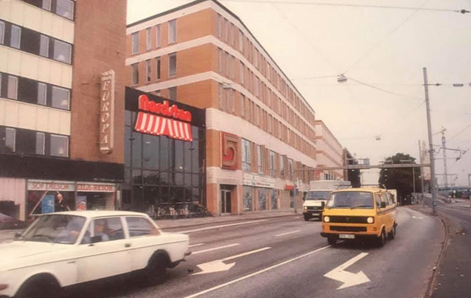

### 1980 User raphael has logged in.
Född här i Göteborg. Familjen flyttade till Majorna, som enligt morföräldrarna var "långt ifrån stan".

### 1985 Min första dator
Min farmor, som föddes i Kiev 1911, hade en viss känsla för tidsandan och var övertygad om att persondatorer skulle forma framtiden. Tillsammans med en teknikintresserad vän till familjen gav de min bror en ZX Spectrum i present kring 1982, som jag sedan fick ta över när brorn skaffade en Amiga 500. 

1985 släpptes spelet Elite (på band förstås). Jag tjatade hål i huvudet på brorn tills han lärde mig grunderna i ZX Basic och hur man ritade enkla figurer på skärmen.
### 1989 Kerningham and Richie C
Jag lärde mig C på egen hand, kodade på svågerns gamla 80286:a, men eftersom detta var innan internet så visste jag inte att det fanns en ny C89-standard och lärde mig redan då gammal 70-tals C (K&R) med en bok från biblioteket.
### 1997 Usenet
Detta var året familjen kopplade upp. Telefonmodem och min första PC, en splitterny Pentium II 266 MHz, som jag sparat till i flera år. Hade använt en Amiga 600 tills dess, som släkten lagt ihop till kring '92 -- som dessutom fortfarande fungerar fint. 
### 1998 Free as in Freedom
Efter en kompis på gymnasiet pratat om open source installerade jag Red Hat Linux från en CD som följde med en datortidning. Jag blev djupt imponerad! Ännu mer imponerad blev jag några år senare av FreeBSD 4. 
### 1999 Naturvetenskapligt basår
Eftersom jag läste musik på gymnasiet behövde jag komplettera och läste ett basår på universitetet. Lärde mig Ada och ML som förberedelse för fortsatta studier.
### 2000 Datavetenskapligt program
Utbildningen jag skulle läsa (MatNat) lades ner året jag började, så hamnade på Datavetenskap istället. Där använde vi Java och Haskell, inte Ada eller ML....
### 2001 Handledare, programmering
I början av 2000-talet var tyvärr glappet mellan gymnasiet och universitetet enormt. Det pratades mycket om snedrekrytering osv, men grundproblemet var att kurserna hade massvis med dolda förkunskapskrav, särskilt i matematik och programmering. Jag kunde ju redan programmera, så hjälpte till som handledare på första årets kurser.
### 2002 Kursansvarig, introduktionskurser, servicetekniker chalmers
Det hela urartade snabbt och jag blev kursansvarig för hela introduktionskurserna på matematik och datavetenskap. Jag jobbade även i servicedesk på Chalmers eftersom jag vid det laget lärt mig Solaris® systemet i skolan. En studiekamrat lärde mig Python och vi skrev en kompilator till en enkel version av Python (2) som projekt. Läste väldigt många kurser också, det hela blev _lite_ stressigt.
### 2004 Internationella Relationer
Jag studerade IR och internationell politisk ekonomi i ett år. Behövde lite annan takt ett tag.
### 2005 Kursansvarig, alla introdutkionskurser
Det gick sådär med annan takt, istället hade jag 1100 elever varje år och 20 anställda. 14 program hade alla sina introkurser via mina paket. Lämnade universitetet först 2007....
### 2010 Ericsson 
Efter att ha konsultat omkring som IT-tekniker och programmerare några år träffade jag en gammal elev på en fest och två veckor senare jobbade jag på Ericsson. Jag kunde redan Erlang sedan universitetet och se där, min handledare från exjobbet började några månader senare....
### 2017 Machine Learning
Två banbrytande uppsatser, "Attention is all you need" och "Cliques of Neurons Bound into Cavities Provide a Missing Link between Structure and Function" övertygade mig om att "AI-vintern" verkligen var över. 
### 2018 Chalmers
Efter Ericsson gjorde jag några inhopp på Volvo men sedan hamnade jag på Chalmers igen, denna gång som python-utvecklare på IT-avdelningen.
### 2019 Synteda
Tillsammans med gamla kollegor och några investerare startade vi ett eget bolag med ML/AI inriktning, Synteda. Vi är konsulter inom data science, maskininlärning och datorvision men har även intern produktutveckling och R&D. 
### 2021 Fysik
Det var enna kul att vara i skolan igen! Så jag läste fysik några år när projektet på Chalmers avslutades.
### 2024- IT-Högskolan
Tillbaka som lärare! Jag jobbar numer med utbildning, forskning och utveckling -- så samma som jag hade gjort i en akademisk karriär men privat.

Några av mina många intressen:

    Astronomi
    Musik
    Matematik
    Programspråk
    Autonoma system
    Evolutionär beräkning
    Neurovetenskap